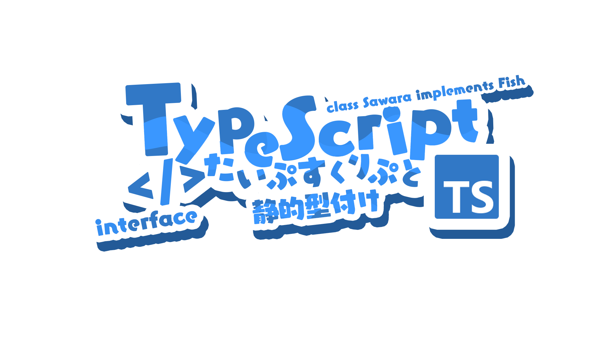

# image-uploader

一个 [nanarinostyl](https://nanarino.github.io/nanarinostyl/) 主题的，用于图片上传的 [vue3](https://vuejs.org/) 组件 demo

```shell
# 安装依赖
pnpm i

# 运行
pnpm vite

# 构建
pnpm build

```

也含有几个其他组件

## Item Frame

  
  
  
